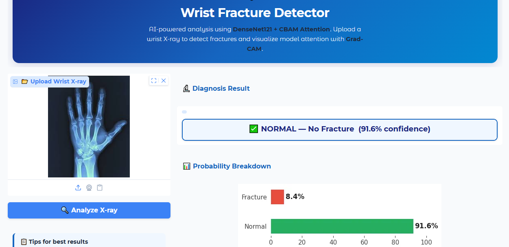
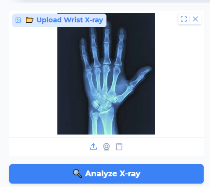
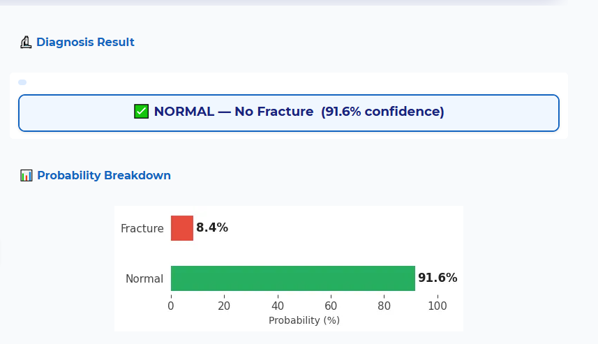
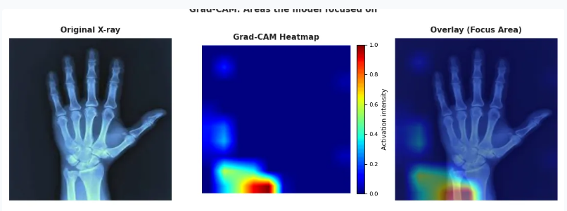

<p align="center">
  
</p>

<h1 align="center">🦴 Explainable Wrist Fracture Detector</h1>

<p align="center">
  An explainable AI web app that detects <strong>wrist fractures from X-ray images</strong> using <strong>DenseNet121 + CBAM Spatial Attention</strong>, with real-time Grad-CAM heatmap visualization.
</p>

<p align="center">
  
  
  
  
  
  
</p>

<p align="center">
  
  
  
</p>

> ⚠️ **Medical Disclaimer:** This tool is for **research and educational purposes only**. It is *not* a substitute for professional medical diagnosis. Always consult a qualified radiologist or physician.

---

### 📑 Table of Contents

* [Live Demo](#-live-demo)
* [Screenshots](#-screenshots)
* [Tech Stack](#-tech-stack)
* [Model Architecture & Performance](#-model-architecture--performance)
* [Explainability — Grad-CAM](#-explainability--grad-cam)
* [Dataset](#-dataset)
* [Project Structure](#-project-structure)
* [How to Run Locally](#-how-to-run-locally)
* [Contact](#-contact)

---

### 🌐 Live Demo

<p align="center">
  <a href="https://huggingface.co/spaces/mmuzammilirshad/Explainable_Wrist_Fracture_Detector">
    
  </a>
</p>

---

### 📸 Screenshots

| Upload X-ray | Diagnosis + Confidence | Grad-CAM Heatmap |
|:---:|:---:|:---:|
|  |  |  |

---

### 🚀 Tech Stack

<p align="center">
  
  
  
  
  
  
  
  
</p>

---

### 🧠 Model Architecture & Performance

The model uses **DenseNet121** as a pretrained backbone with a custom **CBAM Spatial Attention** head and **Focal Loss** for handling class imbalance.

<table>
<tr>
<td>

**Model Architecture**

| Component | Details |
|:---|:---|
| Backbone | DenseNet121 (ImageNet pretrained) |
| Attention | CBAM Spatial Attention (kernel=7) |
| Loss | Focal Loss (γ=2.0, α=0.60) |
| Input Size | 320 × 320 × 3 |
| Output | Sigmoid (binary) |

</td>
<td>

**Training Performance**

| Metric | Value |
|:---|:---|
| Dataset | MURA (Wrist subset) |
| Task | Binary Classification |
| Classes | Normal / Fracture |
| Optimizer | Adam |
| XAI Method | Grad-CAM |

</td>
</tr>
</table>

<details>
  <summary>💡 Why DenseNet121 + Spatial Attention?</summary>
  <br>
  DenseNet121's dense connections allow each layer to access feature maps from all previous layers, making it excellent at capturing fine-grained bone structure details. The CBAM Spatial Attention module further helps the model focus on clinically relevant regions — suppressing background noise and highlighting fracture-prone areas like the distal radius and scaphoid.
</details>

---

### 🔬 Explainability — Grad-CAM

This project implements **Gradient-weighted Class Activation Mapping (Grad-CAM)** to make the model's decision transparent and interpretable.

| Output | Description |
|:---|:---|
| **Original X-ray** | The uploaded wrist X-ray as-is |
| **Grad-CAM Heatmap** | Activation intensity map (red = high focus) |
| **Overlay** | Heatmap blended onto original image |

The heatmap shows **which regions the model focused on** when making its prediction — making it explainable and trustworthy for medical review.

---

### 📊 Dataset

**MURA** (Musculoskeletal Radiographs) — Stanford ML Group's large-scale dataset for bone abnormality detection.

| Property | Details |
|:---|:---|
| Source | Stanford MURA Dataset |
| Body Part Used | Wrist |
| Task | Normal vs Fracture/Abnormal |
| Image Type | Grayscale X-ray (converted to 3-channel) |
| Preprocessing | CLAHE + Sharpening + Sobel Edge channels |

> 📦 Dataset available at [stanfordmlgroup.github.io/competitions/mura](https://stanfordmlgroup.github.io/competitions/mura/)

---

### 📂 Project Structure

```
Explainable-Wrist-Fracture-Detector/
│
├── app.py                          # Gradio UI + inference + Grad-CAM
├── requirements.txt                # Pinned dependencies
├── README.md                       # Hugging Face Space config
│
├── best_wrist_model.keras          # Trained Keras model (DenseNet121 + Attention)
│
├── screenshots/                    # README screenshots
│   ├── banner.png
│   ├── upload.png
│   ├── result.png
│   └── gradcam.png
│
└── Wrist_Fracture_Notebook.ipynb   # Training notebook (Google Colab)
```

---

### ⚙️ How to Run Locally

1. **Clone the repository**
   ```bash
   git clone https://github.com/m-muzammil-irshad/Explainable-Wrist-Fracture-Detector.git
   cd Explainable-Wrist-Fracture-Detector
   ```

2. **Install dependencies**
   ```bash
   pip install -r requirements.txt
   ```

3. **Run the app**
   ```bash
   python app.py
   ```

4. **Open in browser**
   ```
   http://localhost:7860
   ```

> ⚠️ Make sure `best_wrist_model.keras` is present in the root directory before running.

---

### 📬 Contact

<p align="center">
  <a href="mailto:cornerofcodes00@gmail.com">
    
  </a>
  <a href="https://www.linkedin.com/in/muhammad-muzammil-irshad-05b863333">
    
  </a>
  <a href="https://github.com/m-muzammil-irshad">
    
  </a>
  <a href="https://www.kaggle.com/">
    
  </a>
</p>

---

<p align="center">Made with ❤️ by <strong>Muhammad Muzammil Irshad</strong></p>
